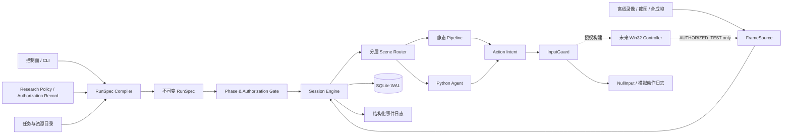

# maaRO3 预客户端架构设计

> 文档状态：Draft / 可执行基线  
> 基准日期：2026-07-26  
> 当前运行模式：`OFFLINE_RESEARCH`  
> 适用范围：尚未取得国服客户端、窗口参数和专项自动化授权之前的工程设计  
> 合规依据：[RO3 自动化项目合规门](./compliance_gate.md)

## 1. 结论与硬约束

maaRO3 当前只建设离线研究、证据管理、录像回放、识别评测和运行时骨架，不连接、发现、附加或控制 RO3 官方客户端，也不发送任何真实键盘或鼠标输入。

只有同时满足以下条件，才允许另行评审是否建立 `AUTHORIZED_TEST` 构建：

1. 取得能够覆盖平台方、游戏权利人、具体地区、服务器、账号、设备、构建版本、动作和有效期的明确书面许可；
2. 完成 `compliance_gate.md` 的 G0～G4，并将许可条目逐项映射到能力白名单；
3. 使用隔离测试环境，并配置人工急停、动作预算、时间预算、事件审计和环境指纹校验；
4. 真实输入后端存在于独立、默认不可达的构建或部署配置中；
5. 任一许可字段缺失、过期、模糊或环境不匹配时，系统拒绝启动，而不是警告后继续。

`OFFLINE_RESEARCH` 不提供 `--force`、跳过门禁、静默降级或“仅本次允许输入”等后门。书面许可仅允许进入下一阶段，并不自动允许正式服运行或公开发布。

## 2. 设计目标与非目标

### 2.1 目标

- 将公开资料、离线录像和未来人工采样转化为可追溯、可复验、可版本化的视觉证据；
- 在客户端未知的情况下先冻结安全边界、模块契约和数据结构，降低 8 月实机采样后的返工；
- 以 Windows 原生客户端为假设，预留 MaaFramework `Win32 Controller`，但不猜测窗口类名、标题、截图后端或输入方式；
- 使用不可变 `RunSpec` 把一次执行的配置、证据版本、授权范围和预算固定下来；
- 用分层场景路由器从当前画面重新建立事实，避免依赖脆弱的长点击链；
- 让每个未来动作都具备意图、前置条件、执行、后置验证和提交记录；
- 将暂停、掉线、未知弹窗、版本变化和识别冲突设计成安全停止，而不是盲目恢复；
- 通过录像 replay、合成画面和故障注入，在不接触真实客户端时验证大部分运行时逻辑。

### 2.2 非目标

- 当前不实现 RO3 登录、日常、自动打怪、挂机维持、采集、交易或副本操作；
- 不把启燃测试的坐标、次数、刷新时间、控件文字或流程当成国服事实写死；
- 不实现进程注入、内存读写、抓包、私有协议、客户端修改、反检测或风控规避；
- 不把 PVP、GVG、排行榜、十人 RAID、交易扫货、多账号打金纳入默认路线；
- 不把 MAA 的视觉方案视为天然合规；模拟用户操作本身仍受适用协议和书面许可约束；
- 不追求在未知画面上“尽量继续”，未知状态的正确结果是保留现场并停止。

## 3. 架构原则

1. **观察先于动作**：先获得新帧并建立场景证据，再产生动作意图。
2. **事实与策略分离**：识别器只报告可观测事实；策略层决定这些事实是否满足任务条件。
3. **配置即快照**：UI、命令行和默认值只用于编译 `RunSpec`；运行中不再读取可变 UI 状态。
4. **输入单一出口**：任何未来真实输入都只能经过 `InputGuard`，业务模块不得直接调用 Controller。
5. **事务化动作**：没有前置条件和后置验证的点击、按键、拖动或等待都不是合法动作。
6. **恢复即重新识别**：暂停、掉线或超时后从新帧进入 Router，不恢复旧坐标或旧点击栈。
7. **预算有上限**：重试、动作、运行时间、连续未知帧和恢复次数都有硬上限。
8. **未知即关闭**：场景冲突、环境变化、授权不匹配和证据不足全部 `fail closed`。
9. **版本化一切易变事实**：模板、OCR 词表、UI 布局、业务次数和重置规则都带地区、构建和采样日期。
10. **回放优先**：每个识别或策略变更先在固定录像集上回归，再讨论授权环境验证。

## 4. 系统上下文



当前发布物中，实线链路止于 `NullInput`；指向 Win32 Controller 的虚线链路仅是接口预留，不是已实现能力。

## 5. 运行模式与能力门

### 5.1 模式状态机

| 模式 | 可用输入源 | 可产生的输出 | 真实窗口截图 | 真实键鼠输入 |
|---|---|---|---:|---:|
| `OFFLINE_RESEARCH` | 本地截图、录像、合成帧、fixture | 识别结果、标注、报告、模拟动作日志 | 否 | 否 |
| `AUTHORIZED_TEST` | 许可指定的离线源和隔离测试环境 | 审计日志、许可范围内的测试结果 | 仅许可明确覆盖时 | 仅许可明确覆盖时 |
| 正式服自动化 | 不存在该模式 | 不适用 | 阻断 | 阻断 |

模式不是普通配置字符串，而是构建能力、许可记录和运行时校验的交集：

```text
effective_capabilities
  = binary_compiled_capabilities
  ∩ policy_allowed_capabilities
  ∩ authorization_allowed_capabilities
  ∩ environment_verified_capabilities
  ∩ run_spec_requested_capabilities
```

任一集合为空或无法验证，结果为空。`OFFLINE_RESEARCH` 二进制不链接真实输入适配器，即使配置文件被篡改也只能得到 `NullInput`。

### 5.2 Phase Gate 输入与输出

门禁读取：

- `config/research_policy.json`；
- 经审查的授权记录元数据，不读取或提交敏感原件；
- `RunSpec.phase` 与 `requested_capabilities`；
- 实际 `EnvironmentFingerprint`；
- 当前时间、构建 ID、账号/设备的脱敏标识；
- 功能级风险审查记录。

门禁只返回两类结果：

- `ALLOW(capability_set, authorization_id, expires_at)`；
- `DENY(reason_code, mismatched_fields)`。

不存在 `WARN_AND_CONTINUE`。

## 6. 核心对象

### 6.1 不可变 `RunSpec`

`RunSpec` 是一次运行的唯一权威输入。控制面先验证和标准化用户选项，再编译成新对象；Engine 启动后不得修改它。运行时调整必须停止旧 run，生成新的 `run_id` 和 `RunSpec`。

建议最小结构：

```yaml
schema_version: 1
run_id: "uuid"
created_at: "2026-07-26T12:00:00+08:00"
phase: OFFLINE_RESEARCH
project_build: "git-or-package-id"

source:
  kind: video_file           # video_file | image_sequence | synthetic_fixture
  uri: "tests/fixtures/..."
  content_sha256: "..."
  clock: recorded            # recorded | fixed_fps | step

target:
  product: ro3
  region: cn
  channel: bilibili
  server: null
  client_build: null
  expected_environment_fingerprint: null

authorization:
  authorization_id: null
  requested_capabilities:
    - offline_frame_read
    - simulated_action_log

task:
  task_id: research.scene_probe
  task_version: 1
  parameters: {}

resources:
  resource_pack_id: "ro3-research-placeholder"
  resource_pack_sha256: "..."
  recognizer_bundle_version: "0.0.0"
  evidence_manifest_ids: []

budgets:
  max_runtime_seconds: 600
  max_observations: 18000
  max_action_intents: 0
  max_recoveries: 0
  max_consecutive_unknown: 3

safety:
  input_backend: null
  unknown_scene_policy: stop
  scene_conflict_policy: stop
  require_postcondition: true

logging:
  redact_text_regions: []
  retain_frames: on_failure_only
  event_level: info
```

编译器职责：

- 应用 schema、类型、范围和互斥关系校验；
- 删除隐藏 UI、旧字段和未选路线的残留值；
- 解析默认值并把它们显式写入快照；
- 计算规范化 JSON 的 SHA-256，保存为 `run_spec_hash`；
- 校验任务声明的 capability 不超出当前模式；
- 固定资源包、识别器、证据清单和规则版本；
- 拒绝未知字段，避免拼写错误悄悄落到默认行为。

Engine 只接收编译完成的 `RunSpec`，不直接接收 UI 字典。这一点继承 MaaKES“控制面 → 规范化快照 → Engine”的有效边界，同时避免其业务字段不断扩张成巨型平面配置。

### 6.2 `EnvironmentFingerprint`

`EnvironmentFingerprint` 描述实际被观察或控制的环境。它不是用户声明，而是由只读探针采集并由门禁比对。

建议字段：

```yaml
schema_version: 1
captured_at: null
source_kind: offline_fixture
product: ro3
region: cn
channel: bilibili
server: null

process:
  executable_name: null
  executable_sha256: null
  file_version: null
  signer_subject: null
  process_arch: null

window:
  title: null
  class_name: null
  client_width: null
  client_height: null
  dpi: null
  display_mode: null
  foreground: null

rendering:
  capture_backend: null
  frame_width: null
  frame_height: null
  color_format: null
  black_frame_rate: null

game_ui:
  locale: zh-CN
  ui_scale: null
  control_mode: null
  build_marker_text: null

device:
  device_id_hash: null
  os_build: null
```

匹配规则分三级：

- **Identity 必须相等**：地区、渠道、服务器、客户端哈希/版本、授权指定设备与账号；不等即停止。
- **Compatibility 必须在白名单**：窗口尺寸、DPI、UI 缩放、截图后端、语言；未标定组合即停止并要求采样。
- **Diagnostic 可记录差异**：OS 小版本、GPU/渲染信息等；只有经过验证不影响识别时才不阻断。

8 月之前 `config/window_profile.example.json` 中的未知字段保持 `null`。不得根据公开视频推断进程名、窗口类名、标题正则或 Controller 模式。

### 6.3 `Observation`

每次路由判断使用一个不可变观察包：

```text
Observation = {
  frame_id, captured_at, source_position,
  environment_fingerprint_id,
  recognizer_bundle_version,
  facts[], scene_candidates[],
  privacy_masks[], frame_digest
}
```

`facts` 只包含从画面直接支持的结论，例如“右上区域检测到小地图轮廓”“弹窗标题 OCR 候选为网络断开”；不得在识别层直接写“应该点击重连”。每个事实至少携带：识别器 ID、区域、分数、阈值版本和可选证据裁剪引用。

## 7. 运行时组件与职责

### 7.1 Control Plane

负责选择离线输入、任务、资源包和运行预算，展示门禁结果，不持有正在运行的可变业务状态。它通过 `RunSpecCompiler` 生成一次性快照，并通过 Engine 的 `start/pause/resume/stop/status` 接口控制会话。

### 7.2 FrameSource / DeviceProvider

统一接口：

```python
class FrameSource(Protocol):
    def fingerprint(self) -> EnvironmentFingerprint: ...
    def next_frame(self) -> Frame: ...
    def close(self) -> None: ...
```

当前实现仅包括：

- `VideoFrameSource`：按时间戳读取本地录像；
- `ImageSequenceSource`：读取 manifest 固定顺序的截图；
- `SyntheticFrameSource`：用于状态机和识别器单元测试。

未来若 G0～G4 通过，才单独设计 `Win32DeviceProvider`：负责窗口发现、客户区坐标换算、DPI 处理、前台状态和 MaaFramework Win32 Controller 生命周期。Controller 的 `class_regex`、`window_regex`、`screencap`、`mouse`、`keyboard` 必须来自实机标定档和授权能力，不能由业务任务覆盖。

### 7.3 Session Engine

Engine 是生命周期监督器，不承载 RO3 业务细节。职责包括：

- 校验 `RunSpec`、模式、授权、资源哈希和环境指纹；
- 创建 FrameSource、Resource、Agent、Tasker 和日志 sink；
- 管理 run 状态机与 cooperative cancellation；
- 调度 Router，执行恢复预算和未知场景策略；
- 统一写入 checkpoint、事件和动作事务；
- 确保停止、异常、暂停和进程退出均调用 `InputGuard.release_all()`；
- 以原子状态转换报告 `completed`、`stopped`、`blocked` 或 `failed`。

建议 run 状态：

```text
CREATED → VALIDATING → READY → RUNNING
                         ├→ PAUSING → PAUSED → REVALIDATING → RUNNING
                         ├→ STOPPING → STOPPED
                         ├→ COMPLETED
                         ├→ BLOCKED
                         └→ FAILED
```

`BLOCKED` 表示合规、环境或人工确认条件不满足；`FAILED` 表示内部实现错误。未知游戏画面通常产生安全的 `STOPPED` 或 `BLOCKED`，不应伪装成普通成功。

### 7.4 Resource / Agent / Tasker

- `Resource` 装载版本化 Pipeline、模板、OCR 词表和模型；资源包需有 hash。
- Python `Agent` 注册复杂识别、策略和状态型 CustomRecognition / CustomAction，但当前 CustomAction 只能生成模拟意图，不能输入。
- `Tasker` 执行 Maa Pipeline；Engine 负责绑定和监听通知。

Agent 与 Engine 使用明确的事件协议交互，不依赖解析人类日志文本来获知关键状态。Agent stdout 可以保留用于诊断，但 `fatal_stop`、checkpoint、动作意图和场景证据必须走结构化事件。

## 8. 分层场景 Router

路由器每次只根据最新 `Observation` 判断当前场景，不假定“上一步点击成功”。建议层次：

```text
Safety
├─ AuthorizationOrPolicyPrompt
├─ AntiCheatOrGMNotice
├─ SensitiveOrPaymentPrompt
└─ UnknownBlockingModal
Connection
├─ LauncherOrLogin
├─ Loading
├─ Disconnected
└─ MaintenanceOrQueue
Home
├─ CharacterSelection
├─ MainHUD
└─ MainMenu
OpenWorld
├─ Town
├─ Field
├─ Navigation
└─ BuiltInAssistPanel
Combat
├─ Idle
├─ BuiltInAssistActive
├─ DeadOrDefeated
└─ Result
Dialogue
├─ NPC
├─ Quest
├─ Reward
└─ Confirmation
Unknown
```

优先级固定为 `Safety > Connection > blocking modal > known business scene > Unknown`。Router 输出：

```text
RouteDecision = {
  scene_id,
  confidence,
  evidence_fact_ids,
  ambiguity_set,
  allowed_handlers,
  decision_version
}
```

只有一个场景超过自己的校准阈值、且与其他互斥场景拉开最低 margin 时才可路由。多个高分候选冲突、关键锚点缺失或环境未标定时进入 `Unknown`，不能选最高分“赌一次”。

首期 Router 仅用录像建立场景词典与离线分类能力。旧测试中的日常、挂机、副本和活动只作为候选标签；在国服实机验证前不建立可执行业务路径。

## 9. 静态 Pipeline 与 Python Agent 的边界

| 判断维度 | Maa Pipeline | Python Agent |
|---|---|---|
| 稳定单页、少量锚点 | 适合 | 通常不需要 |
| 短事务、明确成功页 | 适合 | 可提供额外后置验证 |
| 多帧时序、动画、抖动 | 不宜堆大量节点 | 适合维护窗口和一致性判断 |
| OCR 归一化、模糊匹配 | 简单规则可用 | 复杂词表和置信融合更适合 |
| 资源/次数/时间预算策略 | 只消费已编译参数 | 适合纯策略函数 |
| 路径规划、动态目标选择 | 不适合巨型平面路由 | 适合，但必须输出可审计意图 |
| 跨场景持久状态 | 不承担 | 从 StateStore 读取有限 checkpoint |
| 真正发送输入 | 禁止直接发送 | 同样禁止；必须交给 InputGuard |

边界规则：

1. Pipeline 处理稳定页面上的“识别 → 单个短意图 → 验证”；最多跨越一个可证实的界面转换。
2. Python Agent 处理三帧以上一致性、动态 ROI、策略评分、计时器、复杂 OCR 和 Router。
3. 不允许把大量页面堆成一个巨型 Pipeline，也不允许把全部业务塞进一个数千行 Agent 文件。
4. Agent 模块按 `scene`、`recognition`、`policy`、`recovery` 拆分；模块之间通过类型化事实和意图通信。
5. Pipeline 节点和 Agent 行为都必须声明所需 capability、前置场景、成功场景、超时和最大重试次数。

## 10. `InputGuard` 与输入单一出口

`InputGuard` 是未来所有动作的强制仲裁器。当前它只装配 `NullInputBackend`，把合法模拟意图写入动作日志；任何企图指定 Win32 输入后端的 `OFFLINE_RESEARCH` RunSpec 都在启动前失败。

接口示意：

```python
class InputGuard:
    def submit(self, intent: ActionIntent, observation: Observation) -> ActionReceipt: ...
    def release_all(self, reason: str) -> None: ...
    def emergency_stop(self, reason: str) -> None: ...
```

每次 `submit` 至少校验：

- 运行模式和二进制能力允许该动作类型；
- 授权 ID 有效，动作映射到许可条目；
- 环境指纹与许可、RunSpec 完全匹配；
- 当前 scene 在动作白名单中；
- Observation 未过期且前台/窗口状态符合要求；
- 任务、run 和 capability 的动作/时间预算未耗尽；
- 没有 pause、stop、急停或异常标记；
- 动作坐标由当前帧锚点推导，位于客户区和声明 ROI；
- 同一幂等键没有已提交事务；
- 动作声明了可判定的后置条件。

`release_all()` 必须幂等，释放所有按键、鼠标按钮、拖动和组合键状态。它在以下路径无条件执行：暂停请求、停止请求、异常、Controller 断开、窗口失焦、环境变化、预算耗尽、进程信号和 Engine finally 清理。

项目永久不提供随机化延迟、类人轨迹、检测规避或反作弊绕过选项。时间抖动只能为 UI 稳定性服务，并以确定性的测试种子重放。

## 11. 动作事务

### 11.1 生命周期

```text
PROPOSED
  → PRECONDITION_VERIFIED
  → DISPATCHED
  → SETTLING
  → POSTCONDITION_VERIFIED
  → COMMITTED
```

异常分支为 `REJECTED`、`ABORTED`、`TIMED_OUT`、`POSTCONDITION_FAILED`。除非策略明确声明动作可安全重试，并且重试预算未耗尽，否则失败后不重复输入。

### 11.2 `ActionIntent`

最小字段：

- `action_id`、`run_id`、`task_id`、`transaction_id`；
- `kind`：模拟记录、click、key、drag、text 等；
- `purpose`：面向人的业务意图；
- `authorization_clause_id` 与 `required_capability`；
- `source_observation_id`、`expected_scene`、证据 fact IDs；
- 锚点和相对 ROI，不保存未经校准的全局桌面坐标；
- `preconditions[]`、`postconditions[]`；
- `settle_policy`、`deadline`、`max_attempts`；
- `idempotency_key`；
- `sensitivity`：normal / irreversible / economic / competitive。

`economic`、`competitive` 与不可逆动作默认拒绝，即使其他授权测试动作可用，也必须独立功能级审批。

### 11.3 提交语义

- **意图写前日志**：先把 `PROPOSED` 持久化，再执行后端调用。
- **执行收据**：记录后端、时间、窗口/帧指纹和实际低级动作摘要。
- **新帧验证**：等待由 `settle_policy` 定义的新帧序列，不能用输入调用成功作为业务成功。
- **提交**：只有后置条件成立才更新业务 checkpoint 和 `daily_progress`。
- **失败保留现场**：保存允许留存的失败帧引用、识别证据和原因码。
- **崩溃恢复**：启动时发现 `DISPATCHED` 但未提交的事务，标记为 `ABORTED_UNCERTAIN`；重新路由并要求人工确认，禁止盲重放。

## 12. SQLite WAL 状态模型

运行状态统一存放在 `runtime/state.sqlite3`，启用 WAL、外键、busy timeout 和显式事务。配置、截图原件和大体积录像不塞进数据库；数据库只保存内容哈希、相对引用和结构化元数据。

建议核心表：

### 12.1 `runs`

| 字段 | 说明 |
|---|---|
| `run_id TEXT PRIMARY KEY` | UUID |
| `run_spec_json TEXT NOT NULL` | 规范化不可变快照 |
| `run_spec_hash TEXT NOT NULL` | 快照 SHA-256 |
| `phase TEXT NOT NULL` | `OFFLINE_RESEARCH` / `AUTHORIZED_TEST` |
| `task_id TEXT NOT NULL` | 任务标识 |
| `status TEXT NOT NULL` | 生命周期状态 |
| `authorization_id TEXT` | 离线模式为空 |
| `environment_fingerprint_id TEXT` | 实测指纹引用 |
| `started_at / ended_at TEXT` | ISO 8601 + 时区 |
| `stop_reason_code TEXT` | 机器可读原因 |
| `created_by_build TEXT NOT NULL` | 项目构建标识 |

### 12.2 `environment_fingerprints`

保存规范化指纹 JSON、SHA-256、采样时间、兼容性 profile 和匹配结论。账号、设备只保存盐化 hash，不保存凭据或明文身份信息。

### 12.3 `checkpoints`

| 字段 | 说明 |
|---|---|
| `checkpoint_id INTEGER PRIMARY KEY` | 单调 ID |
| `run_id TEXT NOT NULL` | 外键 |
| `sequence INTEGER NOT NULL` | run 内序号 |
| `scene_id TEXT NOT NULL` | 已验证场景 |
| `task_state_json TEXT NOT NULL` | 小型、版本化的业务状态 |
| `observation_id TEXT NOT NULL` | 支持该状态的观察 |
| `last_committed_action_id TEXT` | 最近成功事务 |
| `created_at TEXT NOT NULL` | 时间 |

checkpoint 只能在动作事务提交后或纯观察稳定点写入。不得保存“下一个坐标要点哪里”之类瞬时点击栈。

### 12.4 `action_journal`

保存 `ActionIntent`、状态、幂等键、许可条目、前后观察、尝试次数、后端收据、失败原因和时间。对 `run_id + idempotency_key + committed` 建唯一约束，避免重启后重复提交。

### 12.5 `daily_progress`

仅在未来有经实机验证且获许可的业务任务时启用：

| 字段 | 说明 |
|---|---|
| `profile_scope TEXT` | 脱敏角色/服务器作用域 |
| `business_date TEXT` | 由版本化 reset policy 推导 |
| `task_key TEXT` | 稳定任务标识 |
| `ruleset_version TEXT` | 次数/重置规则版本 |
| `observed_count INTEGER` | 从 UI 观察到的进度 |
| `committed_count INTEGER` | 本工具已验证提交次数 |
| `last_observation_id TEXT` | 证据引用 |
| `confidence REAL` | 进度可信度 |

启燃测试中的“每日 60 分钟”“MVP 5 次”等不能预填为默认规则，只能作为研究事实存于证据库。

### 12.6 `run_events` 与 `observations`

- `run_events` 是 append-only 结构化事件索引，保存序号、类型、级别、组件、关联 ID、payload 和时间；
- `observations` 保存帧 hash、来源位置、识别 bundle、事实摘要、场景决策和可选 artifact 引用；
- 大图、裁剪和录像留在 artifact 目录，数据库引用相对路径及 hash；
- 对事件 payload 做 schema versioning，便于旧日志迁移和分析。

数据库写入要求：

- `PRAGMA journal_mode=WAL`、`foreign_keys=ON`、合理 `busy_timeout`；
- 单写线程或串行 writer queue，识别线程不直接争抢事务；
- 状态迁移与对应事件在同一事务中提交；
- schema 迁移只向前，不自动吞掉失败；
- 崩溃后先做完整性检查和未决事务审计，再允许新 run。

## 13. 事件日志与可观测性

日志同时提供：

1. 人类可读的滚动文本日志；
2. 每 run 一个 JSONL 事件流；
3. SQLite 中可查询的关键事件索引；
4. 按留存策略保存的失败 artifact。

通用事件 envelope：

```json
{
  "schema_version": 1,
  "event_id": "uuid",
  "sequence": 42,
  "timestamp": "2026-07-26T12:34:56.789+08:00",
  "level": "info",
  "component": "router",
  "event_type": "scene.decision",
  "run_id": "uuid",
  "task_id": "research.scene_probe",
  "observation_id": "uuid",
  "action_id": null,
  "message": "识别为 MainHUD",
  "payload": {},
  "redaction_applied": true
}
```

最低事件集：

- `run.created/validated/started/paused/resumed/stopped/completed/failed/blocked`；
- `gate.allowed/denied`、`environment.captured/mismatch/changed`；
- `frame.received/dropped`、`recognition.fact`、`scene.decision/conflict/unknown`；
- `action.proposed/rejected/dispatched/committed/failed/uncertain`；
- `checkpoint.created/restored/rejected`；
- `budget.warning/exhausted`、`input.release_all`、`emergency_stop`；
- `artifact.saved/redacted/retention_denied`。

禁止记录账号密码、身份证信息、完整聊天、其他玩家名称或未脱敏授权原件。OCR 原文默认只保存完成诊断所需的最小片段；敏感 ROI 先遮罩再落盘。

## 14. 暂停、恢复与停止

### 14.1 暂停

暂停是协作式安全停顿：

1. Engine 设置 `pause_requested`，不接受新意图；
2. 当前识别计算可以结束，但未发送的意图全部拒绝；
3. `InputGuard.release_all("pause")`；
4. 若存在已发送未验证动作，将事务标为不确定并保存现场；
5. 在可验证稳定点写 checkpoint；
6. 进入 `PAUSED` 并持续允许 stop / emergency stop。

### 14.2 恢复

恢复不是从原节点继续：

1. 重新执行 Phase Gate 和授权有效期检查；
2. 重新采集并比对 EnvironmentFingerprint；
3. 丢弃旧帧、旧 ROI、旧 hover 和旧点击栈；
4. 获取至少一个新的稳定 Observation；
5. 从 Router 根节点重新分类；
6. 仅用已提交 checkpoint 恢复有限业务进度；
7. 当前场景与 checkpoint 不一致时，以新观察为准并停止自动推进，等待明确恢复策略或人工确认。

这沿用 MaaKES“暂停后重新识别当前页面”的正确经验，并把它提升为事务和环境级约束。

### 14.3 停止和进程异常

所有退出路径共享同一个幂等 shutdown：停止接收意图 → 释放输入 → 关闭 Tasker/Agent/Resource/FrameSource → flush 事件 → 提交最终 run 状态。若 flush 失败，保留独立 emergency log，但不能因此阻塞输入释放。

## 15. 未知场景与故障恢复

### 15.1 Unknown 策略

当出现任一情况时进入 `Unknown`：

- 没有场景达到阈值；
- 两个互斥场景同时达到阈值；
- 安全层识别器报冲突；
- 帧全黑、冻结、尺寸突变或截图后端异常；
- UI 版本、语言、缩放或控制模式未标定；
- 关键弹窗仅部分可见，无法判断按钮语义；
- 观察超出允许的新鲜度。

处理流程：

1. 立即禁止输入；
2. 在预算内再采集少量帧，区分瞬态动画和稳定未知画面；
3. 保存经隐私处理的现场、识别分数、冲突候选和环境差异；
4. 若连续未知达到 RunSpec 上限，安全停止；
5. 给出人类可操作的原因码，不自动按 Esc、回城、点关闭或返回首页。

### 15.2 恢复等级

| 等级 | 范围 | 示例 | 当前离线阶段行为 |
|---|---|---|---|
| R0 | 纯观察重试 | 动画、帧丢失 | 读取下一帧 |
| R1 | 同场景重新识别 | OCR 抖动 | 调整时间窗，不改变画面 |
| R2 | 已知可逆 UI 恢复 | 关闭无害提示 | 只生成模拟意图；真实动作阻断 |
| R3 | 跨场景恢复 | 重连、返回主界面 | 当前不实现 |
| R4 | 人工介入 | 协议、支付、GM、未知弹窗 | 保存现场并停止 |

恢复预算按 run、scene 和 reason 分别计数，避免在两个页面之间无限震荡。任何安全提示、许可弹窗、经济动作或其他玩家相关场景都不能自动恢复。

## 16. 录像 Replay 测试

### 16.1 Fixture 结构

每个 replay fixture 建议包含：

```text
tests/fixtures/<case-id>/
├─ manifest.json
├─ frames/ 或 clip.mp4
├─ annotations.jsonl
├─ expected_events.jsonl
├─ expected_actions.jsonl
└─ README.md
```

Manifest 必须记录来源许可、内容 hash、原始分辨率、FPS/时间戳、地区、客户端构建、UI 缩放、控制模式、脱敏状态和可再分发范围。公开视频截图只能在版权与引用范围内保存必要关键帧，不能提交整段视频。

### 16.2 测试层次

1. **Recognizer unit**：固定裁剪上的模板/OCR/特征结果；
2. **Scene classification**：整帧或帧序列的场景标签、阈值和冲突行为；
3. **Router replay**：输入时间线，断言 RouteDecision 和 Unknown 点；
4. **Policy simulation**：输入事实序列，断言模拟 ActionIntent，不调用输入；
5. **Transaction simulation**：故障注入验证写前日志、后置失败和幂等性；
6. **Pause/resume replay**：在任意帧暂停，恢复后必须从 Router 根重建场景；
7. **Environment drift**：分辨率、DPI、UI scale、语言和版本变化应阻断未标定组合；
8. **Golden event log**：验证事件顺序和原因码，不绑定动态 UUID/时间戳。

### 16.3 识别质量指标

按场景和 build 分开报告 precision、recall、unknown rate、conflict rate 和 latency；不得只给总体 accuracy。Safety 场景以漏报率为首要指标，Unknown 宁可偏高，也不能为了覆盖率降低安全阈值。

资源更新的合并条件至少包括：

- 新数据集与历史数据集均通过；
- 无 Safety 漏报回归；
- Unknown/冲突变化得到解释；
- 阈值变化关联到 evidence manifest 和评测报告；
- 录像之外的合成负样本通过。

## 17. 建议目录结构

以下是目标结构，不要求预客户端阶段一次性创建空文件：

```text
maaRO3/
├─ agent/
│  ├─ main.py
│  ├─ recognition/          # 事实提取，不做策略
│  ├─ router/               # 分层场景分类
│  ├─ policy/               # 纯策略 → ActionIntent
│  └─ recovery/             # 有界恢复决策
├─ automation/
│  ├─ engine.py
│  ├─ run_spec.py
│  ├─ phase_gate.py
│  ├─ environment.py
│  ├─ input_guard.py
│  ├─ transactions.py
│  ├─ event_logger.py
│  ├─ state_store.py
│  └─ frame_sources/
├─ assets/
│  ├─ interface.json
│  └─ resource/
│     ├─ pipeline/
│     ├─ image/
│     ├─ models/
│     └─ resource_manifest.json
├─ config/
│  ├─ research_policy.json
│  ├─ window_profile.example.json
│  └─ schemas/
├─ docs/
│  ├─ design/
│  └─ research/
├─ research/
│  ├─ catalog/
│  └─ evidence/
├─ runtime/                 # gitignored，本地数据库与日志
├─ tests/
│  ├─ fixtures/
│  ├─ replay/
│  ├─ unit/
│  └─ integration/
└─ tools/research/
```

业务任务未来按垂直 slice 放置自己的 pipeline、recognition、policy 和 replay cases；不要把所有 RO3 页面都接入一个平面“全局路由”文件。

## 18. 版本化与配置规则

每条易变业务事实使用以下作用域：

```text
RuleScope = region + channel + server_kind + client_build_range
            + locale + ui_scale_profile + observed_at
```

- 次数、开放等级、刷新周期、奖励和入口只存在于 ruleset，不进代码常量；
- 模板带 `resource_pack_version` 与适用 Environment profile；
- OCR 文案允许同义词，但每个词条记录来源和首次/末次验证 build；
- 未知 build 不自动继承最近规则，只允许以显式兼容性报告放行；
- 任何研究来源都区分“官方规则”“制作人说明”“玩家实测”“单帧推断”；
- 旧测试事实默认是待复核快照，不能作为 RunSpec 默认值。

## 19. 与 MaaKES 的关系

### 19.1 可复用的架构经验

| MaaKES 经验 | maaRO3 的采用方式 |
|---|---|
| 控制面 → 执行配置规范化 → Engine | 升级为 schema 严格、带 hash 的不可变 `RunSpec` |
| Engine 管理 Controller/Resource/Agent/Tasker | 保留生命周期分工，Controller 改为未来 Win32 provider |
| 静态 Pipeline 处理稳定页面 | 用于短事务，必须声明场景和后置条件 |
| Python Agent 处理复杂 CV 和路线 | 拆成 recognition/router/policy/recovery，并输出类型化意图 |
| 启动探针与保守恢复 | 扩展成分层 Router、EnvironmentFingerprint 和 fail-closed |
| 原子状态写入、结构化日志 | 使用 SQLite WAL + JSONL 事件，不依赖散落 JSON |
| 暂停后重新识别 | 作为强制恢复语义，丢弃旧帧与旧点击栈 |
| Pipeline 静态审计 | 检查悬空节点、无限循环、未声明 capability 与缺失后置条件 |

### 19.2 不复用的实现

- KES 专属地图、队伍、卡牌、事件、命运、装备等业务模块；
- ADB、MuMu、端口发现、移动端坐标和模拟器恢复逻辑；
- 巨型平面 Runtime Pipeline 与大量 legacy alias；
- 数千行单文件 Agent 和业务模块间的隐式全局状态；
- 以 `automation_state.json` 等多个散落 JSON 充当运行数据库；
- 在 UI Option、Pipeline 和 Python 中多处复制坐标或规则；
- 通过 Agent stdout 文本反向解析关键控制状态；
- 失败后“唤醒一次再点首页”等缺少场景证明的乐观恢复。

复用的是边界和经验，不复制 MaaKES 的代码或业务资源；`D:\vscode\maaKES` 保持只读。

## 20. 安全与隐私

- 授权原件、账号、设备明文、聊天和个人身份数据不提交仓库；
- 日志与 artifact 默认本地保存，按最小留存期清理；
- 失败截图保存前执行固定隐私遮罩，并记录遮罩版本；
- 外部视频和截图记录出处、时间戳、版权/再分发范围，不提交完整视频；
- 插件、模型和资源包保存来源与 hash，不运行不受信任脚本；
- 急停优先于日志完整性和任务收尾；
- 不提供凭据自动填写、验证码识别或反作弊处理能力。

## 21. 预客户端阶段的接口骨架验收

在不连接 RO3 客户端的前提下，架构骨架达到“可进入实机采样”至少需要：

- `RunSpec` schema 能拒绝未知字段、真实输入和非零动作预算；
- `OFFLINE_RESEARCH` 构建只能创建三种离线 FrameSource 和 NullInput；
- 环境指纹可对 fixture 生成稳定 hash，并对变化给出字段级 diff；
- Router 可在合成帧中识别 Safety / Known / Unknown 三类并保守处理冲突；
- 模拟动作事务能验证写前日志、后置失败、幂等和崩溃恢复；
- SQLite WAL 在进程中断后保持一致，未决动作被标记为 uncertain；
- 任意时点 pause/stop 都会触发 `release_all`，恢复从根 Router 开始；
- replay runner 可生成逐场景质量报告和 golden event diff；
- Pipeline 静态检查能发现悬空 next、无上限循环、输入动作和缺失 capability；
- 项目中不存在可实例化的 Win32 输入后端、坐标、窗口正则或 RO3 业务动作。

## 22. 待实机回答的问题

这些问题只能在 2026 年 8 月取得客户端并按协议由人工采样后回答：

- 启动器、登录器和游戏窗口的进程、签名、标题、类名及生命周期；
- PrintWindow、ScreenCapture、DXGI Desktop Duplication 的黑屏率、遮挡行为与反作弊兼容性；
- DPI、分辨率、窗口/全屏、UI 缩放、经典/现代控制模式如何影响客户区和 HUD；
- 登录、主 HUD、菜单、日常、挂机、背包、死亡、掉线、维护和更新弹窗的稳定视觉锚点；
- 服务器日期、每日重置、疲劳、挂机加倍和活动次数的国服实际规则；
- 游戏内建辅助战斗的人工操作流程、停止条件和异常表现；
- 是否存在许可允许的屏幕采集或自动化测试环境；若无，架构继续停留在离线回放。

问题未回答不影响离线骨架开发，但会阻断任何真实客户端连接和业务代码冻结。

## 23. 架构决策记录摘要

| ID | 决策 | 理由 |
|---|---|---|
| ADR-001 | 默认且当前唯一模式为 `OFFLINE_RESEARCH` | 通用协议已构成核心能力阻断，专项许可缺失 |
| ADR-002 | 原生 Windows 客户端使用 Win32 Controller 预留 | 已知首测平台为 Windows PC；移动端/模拟器假设不成立 |
| ADR-003 | Engine 只接受不可变 RunSpec | 保证可复现、可审计，消除 UI 运行时漂移 |
| ADR-004 | 环境指纹是动作门禁的一部分 | 防止错误版本、窗口、服务器或设备上执行 |
| ADR-005 | 全部输入经 InputGuard 与动作事务 | 统一授权、预算、急停和后置验证 |
| ADR-006 | SQLite WAL 取代散落状态 JSON | 提供事务、关联、崩溃恢复和查询能力 |
| ADR-007 | 暂停恢复从 Router 根重新识别 | 旧坐标和点击栈在变化后的页面不可信 |
| ADR-008 | Unknown 永远 fail closed | 保护账号、其他玩家和测试环境，便于收集反例 |
| ADR-009 | Pipeline 限于稳定短事务，Agent 负责多帧复杂逻辑 | 控制复杂度并保持策略可测试 |
| ADR-010 | 正式服自动化不是路线图中的默认阶段 | 授权测试不等于正式服或分发许可 |

