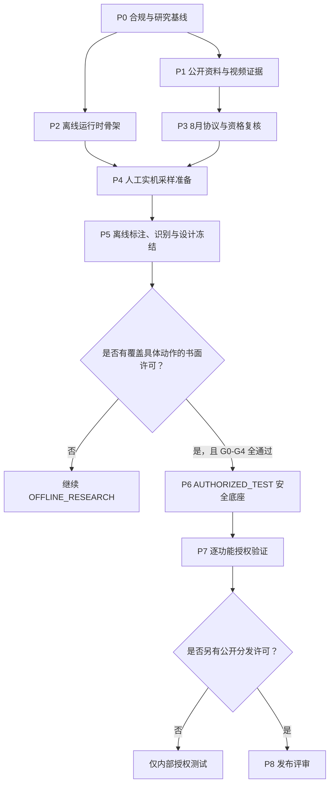

# maaRO3 预研与实施路线图

> 路线图状态：Active / 预客户端阶段  
> 基准日期：2026-07-26（Asia/Shanghai）  
> 当前阶段：`P0 + P1 + P2`，仅 `OFFLINE_RESEARCH`  
> 关键日期：2026-08-25 12:00 资格公布与预下载；2026-08-27 国服“重逢测试”开始  
> 安全基线：[架构设计](./architecture.md) · [合规门](./compliance_gate.md)

## 1. 路线图结论

8 月测试前不写 RO3 真实输入、坐标、窗口正则、登录、日常、自动打怪或挂机代码。现阶段的完成标准不是“脚本能跑”，而是：拿到客户端后能够以合规、可追溯、低返工的方式完成实机采样，并能把采集结果送入离线 replay 验证。

路线图有两个明确分支：

- **没有专项书面自动化许可**：长期保持 `OFFLINE_RESEARCH`，只做公开资料、人工采样、离线识别、录像回放、清单和提示；不连接客户端执行自动化。
- **取得专项书面许可**：仍需通过 G0～G4，才能为许可指定的隔离环境建立独立 `AUTHORIZED_TEST` 构建；许可没有覆盖的功能继续关闭。

获得游戏测试资格、同意普通玩家协议、游戏内置辅助战斗存在、测试服删档或项目非商业开源，都不等于取得自动化许可。

## 2. 阶段依赖



P1 与 P2 可并行；P3、P4 和 P5 是任何业务实现之前的必经路径。P6 不是按日期自动开始，而是由授权证据触发。

## 3. 总体里程碑

| 阶段 | 建议时间 | 核心结果 | 退出条件 | 真实输入 |
|---|---|---|---|---:|
| P0 合规与基线 | 7/26～7/31 | 研究政策、架构边界、来源体系 | `OFFLINE_RESEARCH` 硬门可审计 | 禁止 |
| P1 资料覆盖 | 7/26～8/24 | 多来源玩法与 UI 证据库 | 关键流程有来源、时间点、置信等级和缺口 | 禁止 |
| P2 离线骨架 | 7/27～8/24 | RunSpec、replay、状态库、NullInput 设计/骨架 | 合成与录像测试可重复，无法实例化真实输入 | 禁止 |
| P3 资格与协议复核 | 8/25～8/27 | 当期协议、主体、版本和采集边界 | G0 完整；自动化许可结论明确为“缺失/有效” | 禁止 |
| P4 人工采样 | 8/27 起，测试窗口内 | 国服 build 的人工录屏、截图、流程与环境指纹 | 关键场景覆盖；素材合规且可追溯 | 工具输入禁止；人工操作 |
| P5 离线验证 | 首批素材后 3～10 天 | 标注集、场景 Router、差异矩阵、v1 设计冻结 | 离线质量门通过；未知项有计划 | 禁止 |
| P6 授权测试底座 | 仅 G0～G4 通过后 | Win32 provider、InputGuard、动作事务、急停 | 合成程序和隔离环境安全验收 | 仅许可白名单 |
| P7 功能切片 | P6 通过后逐项 | 有界、可验证的单功能试验 | 每项单独风险审查和 replay 回归 | 仅许可白名单 |
| P8 发布评审 | 无预设日期 | 分发范围、隐私、安全和许可审查 | G5 明确允许分发 | 取决于许可 |

日期是执行窗口，不是放宽门禁的理由。若测试延期、资格未获得或协议禁止录制/采样，对应阶段顺延或取消。

## 4. P0：合规、研究和工程基线

### 4.1 目标

建立所有后续工作共享的安全默认值和证据规范，确保仓库不会因为“先占位”而意外包含可运行的真实输入。

### 4.2 工作包

#### P0-A 合规门

- 固化 `OFFLINE_RESEARCH` 与不可达的 `AUTHORIZED_TEST` 两种模式；
- 保存 Bilibili 通用协议和 RO3 相关官方条款的来源、日期、适用地区与摘要；
- 把正式服无人值守、交易、多账号、PVP/GVG、反检测、内存/协议能力列为默认或永久排除；
- 定义 G0～G6、授权记录最小字段、过期和撤销规则；
- 在 README、Project Interface 和研究策略中使用一致术语。

#### P0-B 研究证据标准

- 每个来源记录平台、URL、作者/主体、发布日期、访问日期、地区、测试版本、可信等级；
- 每张截图记录视频 ID、精确时间戳、原画尺寸、是否含字幕/后期标注、用途和需复核项；
- 结论区分 A 级官方原始资料、B 级制作人/媒体采访、C 级玩家测试快照和 D 级单帧推断；
- 不提交完整第三方视频，只保留研究所需关键帧和 manifest；
- 任何“次数/时间/坐标”都带 build 和观测日期。

#### P0-C 工程零输入证明

- `assets/interface.json` 仅提供研究探针，Win32 参数保持不可匹配占位；
- Pipeline 中只有 `DoNothing` 或离线识别节点；
- `config/research_policy.json` 的 input capability 为 false；
- 测试扫描 Pipeline 和 Python，发现 click/key/swipe/controller input 即失败；
- CI/本地验证不需要 RO3、模拟器或管理员权限。

### 4.3 退出条件

- 合规门和架构文档由维护者复核；
- 来源 schema、manifest 和研究校验脚本能够拒绝缺字段素材；
- 全仓静态检查证明没有真实输入路径；
- 未知窗口字段、国服规则和授权状态都显式为 `null/missing`，没有猜测性默认值。

## 5. P1：公开资料与视频证据覆盖

### 5.1 目标

在国服客户端可得前建立“场景和流程词典”，不是提前冻结自动化流程。公开视频反映的是旧测试 build，只用于回答应该采什么、哪些状态可能存在。

### 5.2 来源路线

按证据优先级持续检索：

1. 国服官网、Bilibili 游戏中心、TapTap 官方账号和当期公告；
2. Gravity、JoyMaker、官方 Discord/社区公告及制作人访谈；
3. Bilibili、YouTube 的长时实机、直播回放和机制攻略；
4. 巴哈姆特、TapTap、NGA/论坛的测试总结与问题反馈；
5. 二次剪辑和短视频只用于发现线索，关键结论必须回到长视频或更高等级来源。

### 5.3 内容覆盖矩阵

每类至少收集“正常入口、进行中、成功、失败/阻断、返回主场景”五种状态；没有素材时标为缺口，不能补想象。

| 领域 | 需要回答的问题 | 优先关键帧/时间线 |
|---|---|---|
| 启动与登录 | 启动器、更新、服务器、角色、排队、维护如何区分 | 每个窗口、标题、错误弹窗 |
| 控制设置 | 经典点地与现代 WASD、UI 缩放、窗口模式如何切换 | 设置页和切换前后 HUD |
| 主 HUD | 小地图、任务栏、菜单、队伍、聊天、自动战斗状态 | 城镇/野外/战斗各一组 |
| 每日面板 | 入口、分类、进度、领奖、已完成状态 | 全面板滚动录制和细节截图 |
| 呆呆委托/任务 | 接取、寻路、对话、战斗、提交、阻塞条件 | 完整人工流程，不只成功片段 |
| 挂机/辅助战斗 | 选地图、选怪、加倍、疲劳、开始/停止、无目标/死亡 | 规则页、HUD 指示、收尾状态 |
| 生活职业 | 活力、采集、制作、背包满、材料不足 | 开始、进度、消耗、结果 |
| 公会与社交 | 物资提交、活动入口、组队/团队招募 | 只研究状态；不冻结自动策略 |
| 副本/MVP | 入口、队伍、机制、结算、拍卖 | 用于排除风险和识别场景 |
| 背包/邮件/奖励 | 红点、容量、领取、过期、不可领取 | 边界与失败状态 |
| 异常 | 掉线、重连、更新、死亡、背包满、权限/协议、验证码 | Safety/Connection 训练集 |

### 5.4 视频学习方法

对长视频采用统一流程：

1. 记录元数据与内容 hash；
2. 用章节、字幕/转写和低频 storyboard 建初始索引；
3. 对关键流程回看原速画面，记录开始、动作、视觉反馈和结束时间；
4. 只抽取证明具体结论所需的最少关键帧；
5. 把画面事实与解说者推断分开；
6. 同一结论寻找第二来源或在缺口栏标记“单源”；
7. 将所有旧测试结论标为“国服 8 月需重验”。

### 5.5 量化退出条件

P1 不是以视频数量作为唯一标准。进入 P4 前至少满足：

- 关键领域矩阵 80% 以上有一个可定位来源；
- 登录、主 HUD、每日面板、挂机和异常五个优先领域至少各有两类来源；
- 每条高影响规则都带可信等级和国服复核标记；
- 关键截图 100% 有 manifest、URL、时间戳和用途；
- 形成“已知场景标签表”和“8 月必须补采清单”；
- 仍不生成任何可执行坐标或点击序列。

## 6. P2：离线运行时和质量骨架

### 6.1 目标

让架构的安全与可测试部分在没有客户端时就能验证。实现顺序遵循“数据契约 → 纯逻辑 → 持久化 → 回放”，最后才是未来设备接口的空壳。

### 6.2 实施顺序

#### P2-A Schema 与类型

- `RunSpec`、`EnvironmentFingerprint`、`Observation`、`RouteDecision`、`ActionIntent` 和事件 envelope schema；
- 任务 manifest 和 capability 声明；
- schema 拒绝未知字段和真实输入 capability；
- 规范化 JSON 与稳定 hash 测试。

#### P2-B 离线输入源

- `ImageSequenceSource`、`VideoFrameSource`、`SyntheticFrameSource`；
- 固定帧时钟和 step 模式；
- 帧 hash、时间戳、掉帧和 EOF 行为；
- 不导入或实例化 Maa Win32 输入能力。

#### P2-C Engine 与状态机

- start / pause / resume / stop / emergency stop；
- `OFFLINE_RESEARCH` Phase Gate；
- NullInput 与零动作预算；
- Router 根节点和 Unknown 安全停止；
- 生命周期事件与统一 cleanup。

#### P2-D SQLite WAL 与事件

- `runs`、`environment_fingerprints`、`observations`、`checkpoints`、`action_journal`、`run_events`；
- 单 writer queue、事务化状态迁移和 schema migration；
- JSONL 事件流与数据库索引一致性；
- 进程被终止后的完整性和 uncertain action 恢复测试。

#### P2-E Replay 与故障注入

- fixture manifest、标注、expected events/actions；
- 模拟场景转换、识别冲突、黑帧、尺寸变化、超时、暂停和恢复；
- deterministic replay 和 golden diff；
- Pipeline 静态审计：悬空节点、无界循环、输入动作、缺 capability、缺后置条件。

### 6.3 P2 明确不做

- 不填 RO3 窗口正则、进程名、Controller 模式；
- 不写登录、任务、挂机、战斗和领奖 Pipeline；
- 不从公开视频计算点击坐标；
- 不连接测试服验证截图；
- 不加入“未来可能有用”的 Win32 输入代码；接口可定义，后端不可实例化。

### 6.4 退出条件

- 同一 fixture 连续 replay 产生相同 RouteDecision、模拟意图和事件序列；
- pause 后 resume 总是从新帧和 Router 根开始；
- 识别冲突、未知环境和非零真实动作预算均 fail closed；
- crash 注入后数据库完整，未决事务不被重放；
- `release_all` 在所有退出路径被调用，NullInput 可断言调用次数；
- 离线运行不依赖网络、官方客户端或外部账号。

## 7. P3：8 月资格、协议和客户端版本复核

### 7.1 8 月 25 日检查单

资格公布和预下载开放后，在安装/启动前完成：

1. 保存当天国服招募公告、测试说明、Bilibili 通用协议和隐私政策的 URL、页面时间和 hash；
2. 记录发行主体、开发主体、渠道、测试名称、服务器、删档/计费状态、有效期；
3. 保存启动器和客户端展示的专项 EULA、测试协议、反外挂规则、保密和录屏/直播规则；
4. 检索“外挂、脚本、辅助、宏、模拟操作、第三方软件、自动、录屏、直播、截图、数据采集、保密、反作弊”；
5. 区分普通测试资格、素材采集许可、自动截图许可和模拟输入许可；
6. 把授权状态填写为 `missing`、`denied` 或经审查的明确记录，禁止用 `unknown=allowed`；
7. 若条款之间冲突或主体不明，按更严格解释阻断并记录问题。

### 7.2 三种结果

| 结果 | 后续动作 |
|---|---|
| 未获得测试资格 | 继续 P1/P2；等待公开资料，不尝试绕过资格或借用账号 |
| 获得资格，允许普通游玩/录制但无自动化书面许可 | 进入 P4 人工采样；工具真实输入继续为零 |
| 获得覆盖具体自动化行为的书面许可 | 仍先完成人工 P4/P5；并行准备 G1～G4 证据，不能直接启用输入 |

专项书面许可必须来自有权代表平台和权利人的主体，并精确覆盖目标行为。客服口头回复、群聊、直播表态和“没有明确禁止”不能进入第三种结果。

### 7.3 退出条件

- G0 材料完整并版本化；
- 录屏、截图、日志和素材分享边界明确；
- 自动化授权状态有证据支持；
- 项目 policy 按更严格规则更新；
- 如禁止录制或带有保密限制，P4 计划相应收缩，素材不进入仓库。

## 8. P4：国服测试人工采样

### 8.1 原则

P4 的所有游戏操作由获资格的测试者人工完成。研究工具可以在协议允许范围内处理已经落盘的录像和截图，但不自动枚举窗口、截图、OCR 叠加、点击或按键。自动屏幕采集也必须有明确许可，不能因为“只读”默认开启。

### 8.2 首日优先级

测试窗口有限时，按以下顺序采样：

1. 客户端和环境元数据；
2. 控制模式、UI 缩放、窗口模式与 HUD；
3. 启动、登录、角色选择、主城、野外和加载流程；
4. Safety / Connection 弹窗和自然出现的异常；
5. 每日面板、任务、游戏内建辅助战斗和挂机规则；
6. 背包、奖励、生活、公会和队伍；
7. 低优先级副本/MVP/GVG 仅收集场景，不设计自动执行。

不要为了采异常而进行可能违反规则、影响账号或其他玩家的操作。掉线、封禁、GM、支付等只记录自然出现或官方提供的安全测试路径。

### 8.3 EnvironmentFingerprint 采样矩阵

先完整跑通一个基准环境，再做差异采样，避免首日因组合爆炸丢失核心流程。

| 维度 | 基准样本 | 差异样本 |
|---|---|---|
| 客户端 | 渠道、build、文件版本/签名 | 每次热更后重采 |
| 窗口 | 推荐分辨率与默认模式 | 窗口化/全屏、尺寸变化 |
| DPI | 当前设备 DPI | 100% / 125% / 150% 中实际可用组合 |
| UI scale | 默认档 | 最小/最大或官方预设档 |
| 控制模式 | 默认模式 | 经典点地 / 现代 WASD |
| 语言 | 国服简中 | 只有客户端实际支持时扩展 |
| 图像质量 | 默认画质 | 低/高画质对锚点与特效的影响 |

每个 profile 记录：采样时间、client build、客户区尺寸、桌面尺寸、DPI、UI scale、控制模式、显示模式、画质、录像工具和是否遮挡。进程/类名/标题由人工诊断工具输出后复核，不手工猜写。

### 8.4 单流程录制协议

每条流程使用一致的人工录制方法：

1. 从可识别稳定页面开始，静置约 2～3 秒；
2. 口述或另行记录当前 build、角色阶段和前置条件；
3. 人工执行一个动作，并保留动作前、反馈中、动作后画面；
4. 记录实际点击/按键含义，而不是仅记录坐标；
5. 记录首个视觉反馈、页面稳定和服务端确认的大致延迟；
6. 成功流程之后补录取消、材料不足、次数耗尽、背包满等可安全复现分支；
7. 结束于稳定页面，再静置 2～3 秒；
8. 当天生成 manifest，避免事后遗忘 UI scale 和上下文。

坐标只能作为该录像的诊断数据；未来动作必须从当前帧锚点和 ROI 推导，不能直接复用录屏绝对坐标。

### 8.5 必采场景清单

- 启动器更新中/已更新、登录、选服、角色选择、加载、主 HUD；
- 经典/现代控制选择、设置、UI scale、键位帮助；
- 主城、野外、安全区、战斗中、自动战斗开/关、无目标、目标死亡、角色死亡；
- 每日面板展开/收起、可领取/已领取/未解锁/次数用尽；
- 任务接取、自动寻路、NPC 对话、战斗、提交、路径受阻；
- 挂机地图和怪物选择、加倍时间、疲劳、队伍状态、开始/停止和收尾；
- 生活职业、活力不足、材料不足、背包满；
- 公会物资、库存有/无、确认和完成；
- 邮件、奖励、背包红点、容量警告；
- 自然出现的断线、重连、维护、更新、协议、安全提示；
- 副本、MVP、RAID、GVG 入口和战斗 HUD，用于识别并排除自动路线。

### 8.6 每日收尾

- 对录像和关键截图计算 hash；
- 备份原始素材到不公开的本地存储；
- 仓库只放许可允许的最小关键帧和脱敏 manifest；
- 更新 build 时间线、规则差异和未采缺口；
- 标记素材是否可用于内部训练、公开 fixture 或只能人工查看；
- 如协议、公告、反作弊提示或客户端 build 改变，立即重跑 G0 并暂停采样工具。

### 8.7 退出条件

- 至少一个基准环境的核心流程素材完整；
- 每个 P1 高优先级缺口有素材或明确“测试期不可达”的说明；
- Safety / Unknown 负样本不是只由合成图构成；
- 所有素材有 build、环境、时间和权限元数据；
- 没有通过 MAA 或研究脚本发送真实输入。

## 9. P5：离线标注、识别评测与设计冻结

### 9.1 数据整理

- 按录制 session 切分 train/dev/test，避免同一连续画面的近邻帧泄漏；
- 给场景、锚点、OCR 区域、弹窗类型和可见状态建立版本化标签；
- 标注“画面无法确定”，不要强制给每帧分配已知场景；
- 对聊天、玩家名、账号和其他个人信息应用不可逆脱敏；
- 将国服规则与启燃测试快照做字段级 diff，不覆盖旧证据。

### 9.2 识别开发顺序

1. Frame quality：黑帧、冻结、尺寸和遮挡；
2. Safety / Connection：协议、安全、维护、掉线和未知阻断弹窗；
3. 一级场景：启动/登录、Home、OpenWorld、Combat、Dialogue、Unknown；
4. 稳定锚点：HUD、菜单、面板标题和状态标记；
5. 业务事实：次数、进度、疲劳、加倍、背包、自动战斗状态；
6. 多帧状态：加载、动画、开始/结束和异常停滞；
7. 策略模拟：只生成 ActionIntent 日志，不执行动作。

### 9.3 临时质量门

在数据量足以估算前，使用以下保守门槛；每项按 build、分辨率和 UI profile 分开报告：

- 冻结的 Safety gate 测试集上不得出现已标注风险场景漏报；
- 已知业务场景 false route rate 不高于 0.1%，无法确定时应进入 Unknown；
- 主要稳定场景 precision ≥ 0.98、recall ≥ 0.95；
- 同一 replay 输入的决策、模拟动作和事件顺序 100% 可重现；
- 标准 720 短边帧的一级 Router P95 处理时间以 250 ms 为初始目标；
- UI profile 未标定时 100% 阻断，不跨 profile 乐观复用模板。

若样本不足，报告置信区间和样本数，不以重复相邻帧虚增指标。安全指标不能通过降低标签覆盖或删除困难样本达成。

### 9.4 设计冻结 v1 的退出条件

- 国服 build 的一级场景图和视觉锚点得到人工复核；
- `RunSpec`、EnvironmentFingerprint、事件和数据库 schema 通过实际素材验证；
- 所有候选功能都有输入、前置场景、成功状态、失败状态、停止条件和风险级别；
- 仍未知的快捷键、规则或 UI 组合保持可配置/阻断；
- Pipeline 与 Agent 的分工按真实复杂度重新评审；
- 输出“可研究功能”“需授权功能”“默认排除功能”三类清单；
- 不因为识别已可用而跨越授权门。

## 10. 授权决策门：P5 之后的唯一分叉

在讨论 Win32 Controller 或真实动作前，维护者必须逐项回答：

| 问题 | 必须证据 | 缺失时结果 |
|---|---|---|
| 谁授权？ | 平台方和权利人有权主体的文件 | 阻断 |
| 授权哪个环境？ | 地区、渠道、服务器、build、账号、设备 | 阻断 |
| 允许何种采集？ | 截图、OCR、窗口发现、录屏方式 | 未列出的采集阻断 |
| 允许何种输入？ | click/key/drag、频率、无人值守、重连 | 未列出的输入阻断 |
| 允许哪些玩法？ | 功能白名单和明确排除项 | 未列出的玩法阻断 |
| 允许保存/共享什么？ | 日志、截图、模板、代码和发布范围 | 默认仅本地内部 |
| 授权多久？ | 起止时间、撤销方式、联系人 | 到期即阻断 |
| 是否隔离公平性影响？ | 专服、专号、经济/排名隔离 | 阻断 |

只有所有必需项回答明确，并完成 G0～G4，项目状态才可由维护者修改为 `AUTHORIZED_TEST_CANDIDATE`。该修改需要代码评审、授权元数据 hash 和独立安全检查，不能由普通 UI 开关完成。

## 11. P6：`AUTHORIZED_TEST` 安全底座（条件阶段）

> 本阶段当前未获授权、未开始，也不得预先实现真实输入后端。

### 11.1 实施顺序

#### P6-A 独立构建边界

- 单独的构建 flag、包名、配置根和运行目录；
- 默认发布包不包含 Win32 input backend；
- 授权记录只保存脱敏元数据和签名/hash；
- 启动时校验时间、build、服务器、账号/设备 hash 和 capability；
- 没有 `--force` 或环境变量绕过。

#### P6-B Win32 只读标定

仅当许可覆盖截图和窗口发现时：

- 实测 class/title/process 组合；
- 比较 PrintWindow、ScreenCapture、DXGI Desktop Duplication；
- 标定客户区、DPI、窗口失焦、遮挡、最小化和尺寸改变；
- 捕获后立即建立 EnvironmentFingerprint；
- 任一热更或指纹变化都回到只读重标定。

#### P6-C InputGuard 与急停

仅当许可覆盖模拟输入时：

- 所有 Controller 输入 API 只对 InputGuard 可见；
- 全局人工急停、最大运行时长、最大动作数和每分钟速率；
- pause、失焦、未知场景、Controller 断开和异常时释放全部输入；
- capability、scene、ROI、Observation 新鲜度和后置条件检查；
- 结构化写前日志和动作收据。

#### P6-D 合成程序验证

先对项目自有的假 UI 窗口验证：

- DPI 和坐标换算；
- click/key/drag 的单一出口；
- 急停和 stuck key 释放；
- 崩溃时 uncertain transaction；
- pause/resume 从 Router 根开始；
- 环境指纹变更阻断。

只有自有合成程序通过，才可按许可在隔离 RO3 测试环境进行最小验证。

### 11.2 最小真实环境验收

第一轮最多允许一个明确、可逆、无经济/竞技影响、许可逐字覆盖的动作，并设置 `max_action_intents: 1`。动作前人工确认目标窗口和场景；动作后必须由新帧证明结果。任何不确定、失焦、弹窗、超时或指纹变化立即急停。

P6 不允许直接以“完成一整套日常”作为首个验收用例。

### 11.3 退出条件

- 授权范围外 capability 在构建和运行时双重不可达；
- 合成 UI 故障注入全通过；
- 隔离环境单动作审计能追溯到授权条目和前后帧；
- 急停 P95 响应和输入释放达到测试计划要求；
- 运行结束没有未解释的 action transaction；
- 运营/授权方要求的报告和事故流程已验证。

## 12. P7：逐功能授权验证（条件阶段）

### 12.1 功能排序

即使进入授权环境，也按风险由低到高推进：

1. **环境诊断**：窗口、build、UI profile 和帧质量，只读且需采集许可；
2. **状态观察器**：主场景、自动战斗、疲劳/次数和异常提示，不输入；
3. **单步可逆 UI 事务**：打开/关闭许可指定的无敏感面板；
4. **人工确认的一次性辅助**：每次动作前由用户确认，动作后验证；
5. **有界重复任务试验**：只有许可明确覆盖循环、无人值守和具体玩法时；
6. **有界恢复**：最后引入，并逐类授权重连/死亡/背包等恢复动作。

游戏内建辅助战斗应先作为“观察和提醒”对象。外部程序启动、维持或重启内建辅助仍属于真实输入，必须有明确授权；不因客户端自带功能自动放行。

### 12.2 单功能 Definition of Ready

任何功能编码前必须具备：

- 功能 ID、用户价值和不做的范围；
- 适用 region/channel/server/build/UI profiles；
- 对应授权条目 ID 和有效期；
- 场景图、前置条件、成功/失败/未知状态；
- 每个动作的锚点、ROI、后置条件和幂等策略；
- 最大动作数、最大时长、最大重试和明确停止条件；
- 对账号、经济、其他玩家、团队和排名的影响评估；
- 至少一个正向、一个负向、一个 Unknown 和一个 pause/resume replay；
- 隐私和 artifact 留存策略；
- 维护者与安全审查者批准。

缺一项就留在设计/采样状态，不进入业务代码。

### 12.3 单功能 Definition of Done

- 离线 replay 与合成 UI 测试全通过；
- Pipeline 静态审计无悬空、无界循环或直连输入；
- 真实授权测试未超动作/时间预算；
- 每次动作有事务日志、前后 Observation 和许可映射；
- Unknown、失焦、指纹变化、暂停和急停均 fail closed；
- 无安全识别回归，无未解释误动作；
- 文档记录 build、资源版本、已知限制和禁用条件；
- 新版本默认关闭，必须显式 capability 白名单启用；
- 授权到期或 build 改变后自动不可运行。

### 12.4 默认不进入 P7 的功能

- PVP、GVG、公会战、排行榜和竞技；
- MVP 争抢、RAID 机制代打和影响团队成员的自动决策；
- 摆摊扫货、自动定价、抢购、倒金和货币转移；
- 多账号、多开、账号农场和打金；
- 付费、充值、交易确认和其他不可逆经济行为；
- 验证码、反作弊、风控规避、随机化反检测；
- 客户端修改、注入、内存、抓包或私有协议。

其中最后一组为项目永久排除，不因普通授权测试而进入 backlog。

## 13. P8：发布门（无预设日期）

内部授权测试不等于允许开源、发布二进制、分发模板或提供使用说明。P8 只有在 G5 有明确分发许可时才建立计划。

发布评审至少覆盖：

- 哪些代码、模板、模型、截图和日志允许公开；
- 许可是否允许普通玩家、正式服、不同渠道或不同地区使用；
- 是否需要账号/服务器白名单、在线撤销或到期机制；
- 第三方素材版权、个人信息和供应链安全；
- 默认配置是否仍 fail closed；
- 不在许可范围的能力是否从发布物物理移除。

若没有 G5，仓库公开内容只能停留在离线研究工具、合成 fixture、架构和不连接客户端的识别能力。路线图不设 `PRODUCTION_BOT` 或“正式服全自动”里程碑。

## 14. 横向工作流

### 14.1 Research Track

- 每周更新来源目录、版本时间线和事实矩阵；
- 每个高影响结论至少安排一次交叉验证；
- 记录视频已看区间，避免反复浏览却没有可追溯产物；
- 把“需要截图”“需要完整流程”“需要国服验证”分成不同队列。

### 14.2 Data Track

- 原素材、本地工作副本、仓库关键帧分层存储；
- manifest 和文件 hash 一起提交；
- 标注 schema 有版本和 migration；
- train/dev/test 按 session 切分；
- 隐私遮罩先于 artifact 入库。

### 14.3 Runtime Track

- 优先纯函数、schema 和 replay；
- Engine 不包含 RO3 业务常量；
- 所有运行状态进 SQLite WAL；
- 关键状态走事件协议，不解析日志文本；
- NullInput 与安全断言始终存在于默认测试矩阵。

### 14.4 Quality Track

- 每个 bug 都尽量沉淀为最小 replay fixture；
- 识别变更报告按场景/profile/build 展示差异；
- Pipeline 静态审计进入提交前检查；
- 安全回归失败时停止合并，不以“总体准确率上升”抵消。

### 14.5 Compliance Track

- 8 月前每周检查国服公告和协议版本；
- 测试期每日关注专项公告、反外挂规则和 build 更新；
- 授权按功能、环境和有效期映射，不做项目级模糊放行；
- 任一变化触发 G0 重审和输入能力撤销。

## 15. 依赖与关键路径

关键路径是：

```text
合规基线
→ 公开资料场景词典
→ 当期协议复核
→ 合规人工实机采样
→ 国服 replay 数据集
→ 场景/环境识别质量门
→ 书面授权 G0-G4
→ AUTHORIZED_TEST 安全底座
→ 单功能验证
```

可提前并行的工作：schema、NullInput、SQLite、事件日志、合成 fixture、离线 FrameSource、Router 接口和研究证据整理。

不能提前并行的工作：窗口正则、截图后端选择、点击坐标、快捷键、业务次数、重置时间、异常恢复和任何真实输入。这些依赖实机证据与授权。

## 16. 风险登记

| 风险 | 概率/影响 | 早期信号 | 应对与停止条件 |
|---|---|---|---|
| 协议禁止模拟操作 | 高/极高 | 通用或专项条款列举 auto/macro | 保持离线；没有书面许可不进入 P6 |
| 测试资格未获得 | 中/中 | 8/25 无资格 | 继续公开资料和离线骨架，不借号/绕过 |
| 测试含保密或禁录 | 中/高 | EULA/弹窗限制截图直播 | 停止录制；只保存允许的人工笔记 |
| build 快速热更 | 高/高 | UI/版本每日变化 | 指纹与资源按 build 分层，变更即回归/阻断 |
| Win32 截图黑屏/反作弊冲突 | 中/高 | PrintWindow 黑帧或客户端告警 | 不尝试绕过；仅评估官方允许方式，否则离线 |
| UI scale/DPI 组合爆炸 | 高/中 | 锚点漂移、字体变化 | 先一个基准 profile，未标定组合拒绝运行 |
| 视频资料偏成功流程 | 高/中 | 缺少失败、弹窗、等待画面 | 将负样本列为 P4 首日优先项 |
| OCR 对特效/字体不稳 | 高/中 | 数字和中文误读 | 多锚点、多帧一致性；低置信进入 Unknown |
| MMO 状态无法幂等 | 高/高 | 点击后服务端延迟/重复提交 | 动作事务、写前日志、新帧验证、uncertain 停止 |
| 业务规则沿用旧测试 | 高/高 | 入口/次数与启燃测试不同 | 所有旧规则带 C 级快照标签，国服重新标定 |
| 测试窗口太短 | 中/高 | 核心流程未覆盖 | 优先环境/一级场景/异常；低优先玩法后移 |
| 第三方视频版权风险 | 中/中 | 仓库出现完整视频/大量截图 | 仅最少关键帧、来源 manifest、限制再分发 |
| 架构过度设计 | 中/中 | 大量空接口无 replay 用例 | 每个模块需由当前离线验收项驱动，延后业务抽象 |
| 恢复循环误动作 | 中/极高 | 页面往返、重试预算持续增加 | 分级恢复、硬预算、Unknown 停止、人工介入 |

## 17. 每周执行节奏

### 测试前

- 周初：从缺口矩阵选择 3～5 个可验证问题；
- 周中：并行看官方资料、长视频和论坛原帖，产出时间点和关键帧；
- 周末：交叉验证事实，更新 source/evidence manifest，跑 schema/replay/静态检查；
- 每周评审：删除无法追溯的结论，确认没有业务代码或输入能力偷跑。

### 测试期

- 每次启动前：检查公告、build、协议和录制边界；
- 每个 session 前：记录 Environment profile 和采样目标；
- 每个 session 后：hash、manifest、脱敏、缺口更新；
- 每日结束：国服/旧测试差异总结，调整次日采样优先级；
- 出现安全提示、协议变化或反作弊异常：立即停止工具采集并回到 G0。

### 测试后

- 先整理/标注，再写识别器；
- 每个识别器变更附评测报告；
- 每个策略想法先输出模拟意图；
- 只有授权决策门通过，才创建 P6 implementation issue。

## 18. Issue 与交付物规范

建议每个工作项包含：

- `phase`：P0～P8；
- `mode`：`OFFLINE_RESEARCH` / `AUTHORIZED_TEST_CANDIDATE`；
- `evidence_ids`：支持该工作的来源/素材；
- `client_builds` 和 `environment_profiles`；
- `required_capabilities`；
- `authorization_clause_id`（离线任务为空）；
- `risk_level`；
- 明确的入口、退出条件和测试；
- 不在范围内的动作。

建议标签：

- `research/source`、`research/video`、`research/gap`；
- `data/manifest`、`data/label`、`data/privacy`；
- `runtime/offline`、`runtime/replay`、`runtime/state`；
- `recognition/safety`、`recognition/scene`、`recognition/business-fact`；
- `gate/blocked`、`gate/needs-written-authorization`；
- `risk/economic`、`risk/competitive`、`risk/irreversible`；
- `build/<id>`、`profile/<id>`。

一个预研 issue 的完成产物应是来源记录、关键帧、事实矩阵、schema、fixture、测试或明确的“无法验证”结论，而不是未经证据支持的坐标和脚本。

## 19. 下一批可直接执行的工作

这些工作都属于 `OFFLINE_RESEARCH`，可以在 8 月前推进：

1. 完成关键领域的来源缺口矩阵，给现有 Bilibili 视频逐个补章节、时间点与 manifest；
2. 从已归档关键帧定义第一版只读场景标签，不做坐标动作；
3. 为图片序列、录像和合成帧定义统一 FrameSource 测试向量；
4. 编写 `RunSpec`、EnvironmentFingerprint 和事件 schema 的设计测试；
5. 建立 SQLite WAL migration 草案与崩溃/未决事务测试方案；
6. 建立 Safety / Known / Unknown 的合成 Router fixture；
7. 编写 8 月 25 日协议归档表和 8 月 27 日人工采样 session 模板；
8. 对 MaaKES 的可复用运行时边界做接口级笔记，继续保持参考仓库只读；
9. 为 Pipeline 静态审计列出输入动作、无界循环和 capability 检查规则；
10. 每周复核国服公告和测试日期，更新计划但不提前写业务代码。

## 20. 阶段成功定义

到 8 月测试前，本项目成功应表现为：

- 研究资料足够告诉测试者“应该采什么、为什么采、如何记录”；
- 仓库具备可复现的离线输入、状态、日志和 replay 设计；
- 任何人都无法通过改一个配置把研究骨架变成真实输入脚本；
- 已知事实、旧测试快照和未知项边界清晰；
- 没有把测试资格误当自动化许可；
- 客户端一旦可得，可以先做协议审查和人工采样，而不是边猜边写点击逻辑。

到 P5 后，成功应表现为：

- 国服实际 build、环境和 UI 场景得到证据支持；
- replay 能复现识别与路由结论；
- 每个候选功能都有完整 DoR 和风险分类；
- 无许可则安稳停在离线能力，有许可则能以最小、可审计、fail-closed 的方式进入 P6。

速度不能代替这些门槛。真正的关键路径是证据、环境和授权，而不是尽早产生可点击的代码。

